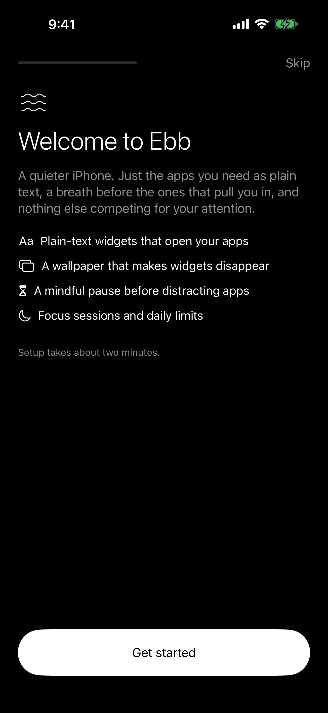
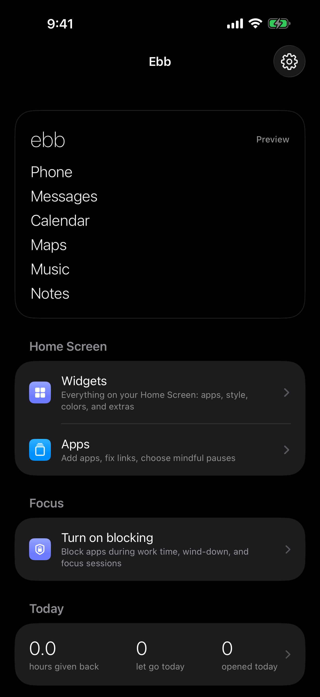
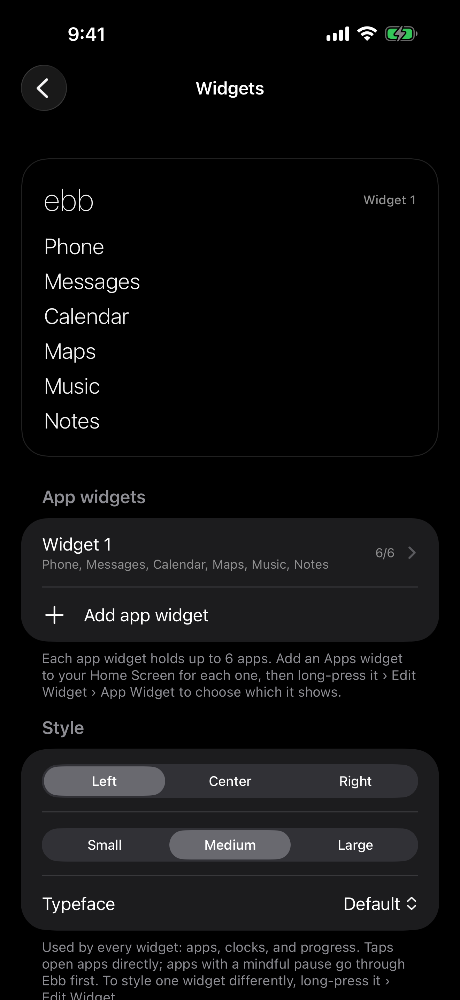
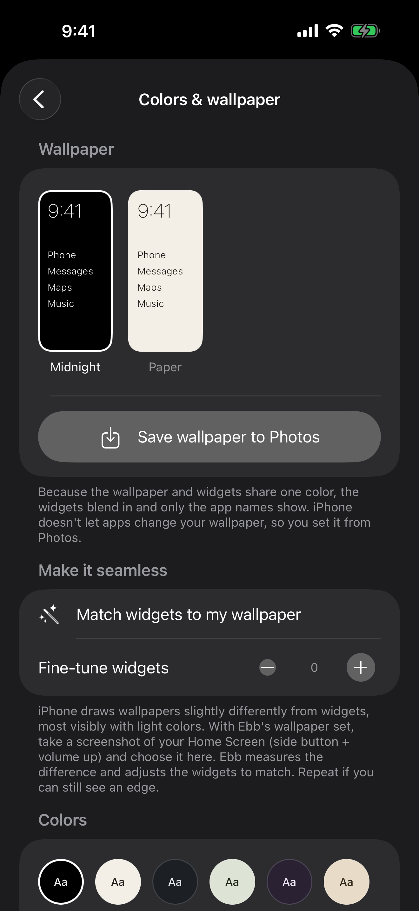
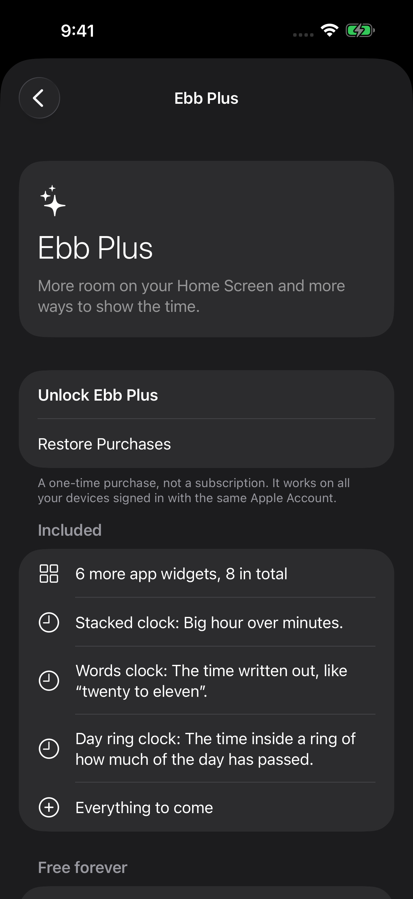

# Ebb

**A calmer iPhone, built from widgets.**

iOS doesn't let apps replace the Home Screen, so Ebb builds one: your apps as plain text on a wallpaper that matches the widgets exactly, with quiet clocks, weather, habits, a to-do list, and a gentle memento mori alongside. The Ebb app is where you set it all up, plus a mindful pause before distracting apps and Screen Time focus schedules that block what you choose.

<p align="center">
  
  
  
  
  
</p>

## Features

### Home Screen widgets
- **Apps**: up to 6 apps per widget, as plain text (medium and large). 2 app widgets free, 8 with Ebb Plus.
- **Clock**: Digital and Analog (free); Stacked, Words, and Day ring (Plus). Updates every minute, with an optional date and day progress bar.
- **Weather**: now, the next hours, or the week, for your location or a city you pick (Apple Weather).
- **Year**: progress through today, this week, month, or year, as a percent, bar, dots, ring, or countdown.
- **Life**: years, weeks, and days left of an average life (CDC 2023 US averages), with a "+" for extra time and *memento mori* on larger sizes.
- **Time Saved**: hours given back from apps you let go and focus sessions, including a full-width Big style.
- **Habits** (Plus): tap to check off today, with a week of dots and your streak.
- **To-Do** (Plus): check things off right on the Home Screen. Finished items stay crossed out and clear at midnight. **+** opens Ebb ready to type.
- **Time & Life** (Plus): time given back and life left in one large widget for the Today View.
- **Spacer**: an empty block in the widget color for laying things out.

Every widget follows Ebb's colors, typeface, and alignment (left, center, or right), and can be changed per widget with Edit Widget.

### In the app
- **Colors and wallpaper**: one color for Ebb, every widget, and a matching wallpaper saved to Photos. Midnight and Paper are built in and calibrated so the widget edges disappear; "Match widgets to my wallpaper" fine-tunes any color.
- **Apps**: finds installed apps, shows their real icons, and searches the App Store from one search bar. Links and Shortcuts cover anything else.
- **Habits** (Plus): a history page per habit with current and best streaks and a six-month heat map. Tap any day to fill it in.
- **To-Do** (Plus): add, check off, reorder, and delete.
- **Mindful pause**: a breathing countdown and an optional "what's this for?" before chosen apps.
- **Focus** (Screen Time): scheduled focuses that block the apps you pick (or, optionally, everything except them), quick focus sessions with a strict mode, a daily limit, and a "Take a breath" button on the block screen that unlocks an app for a set time.
- **Insights**: opens, let-gos, streaks, and reasons, kept on the device for 30 days.
- **Help & Setup**: a setup checklist, a guided walkthrough, and searchable common questions.

Everything stays on the iPhone. There are no accounts, servers, or analytics. Ebb only goes online for App Store app icons and, if you use the Weather widget, Apple Weather.

## Requirements

- Xcode 27 or later
- iOS 26.2 or later
- An Apple Developer Program membership to use Screen Time blocking (Family Controls). Free personal teams can build and run everything else.

## Project structure

| Folder | What it is |
| --- | --- |
| `Ebb/` | The app: dashboard, setup, settings, focus, habits, to-do, insights |
| `EbbWidget/` | Widget extension: Apps, Spacer, Clock, Weather, Year, Life, Time Saved, Time & Life, Habits, To-Do, Open Ebb |
| `EbbMonitor/` | DeviceActivity monitor: starts and ends scheduled blocking |
| `EbbShield/` | Shield configuration: the block screen's look |
| `EbbShieldAction/` | Shield action: the block screen's "Take a breath" button |
| `Shared/` | Code shared by the app and all extensions (app group, colors, plan limits, progress math, weather, habits and to-dos) |
| `SharedScreenTime/` | Code shared by the app and Screen Time extensions (shields, focus schedules) |
| `EbbTests/` | Unit tests |

## Signing

| | |
| --- | --- |
| Team ID | `69ML2GA87D` |
| App bundle ID | `mpbunce.Ebb` |
| Extensions | `mpbunce.Ebb.Widget`, `mpbunce.Ebb.Monitor`, `mpbunce.Ebb.Shield`, `mpbunce.Ebb.ShieldAction` |
| App group | `group.mpbunce.Ebb` |
| Capabilities | App Groups (all targets), Family Controls (app and Screen Time extensions), WeatherKit (app and widget) |

Signing is automatic. Family Controls (Distribution) is approved and enabled for the app and all three Screen Time extensions. WeatherKit must also be ticked under App Services for `mpbunce.Ebb` and `mpbunce.Ebb.Widget`.

## Running

**Simulator**: open `Ebb.xcodeproj`, choose an iPhone simulator, and press ⌘R. Screen Time blocking doesn't work in the simulator.

**iPhone**:
1. In Xcode › Settings › Accounts, sign in with the account for team `69ML2GA87D`.
2. On the iPhone, turn on Settings › Privacy & Security › Developer Mode.
3. Connect the iPhone, choose it as the run destination, and press ⌘R. If macOS asks for keychain access while signing, enter your Mac login password and choose **Always Allow**.

**Tests**:

```bash
xcodebuild test -project Ebb.xcodeproj -scheme Ebb -destination 'platform=iOS Simulator,name=iPhone 17 Pro' -only-testing:EbbTests
```

## Ebb Plus

A one-time, non-consumable in-app purchase with product ID `mpbunce.ebb.plus`, bought and restored in Settings › Ebb Plus. `Ebb/Store/PlusStore.swift` uses StoreKit 2 to check what's owned at launch and on every App Store update (including refunds), and sets `EbbPlus.isActive` in the App Group so the widgets see it too. Plan limits live in `Shared/Plan.swift`. Debug builds include a "Preview Plus features" toggle. `EbbTests/EbbPlus.storekit` is a local StoreKit configuration used by the purchase test.
